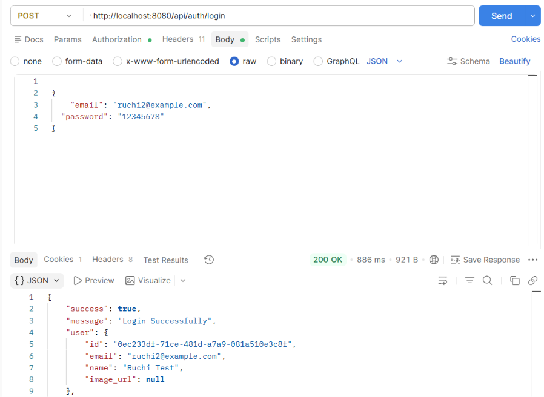
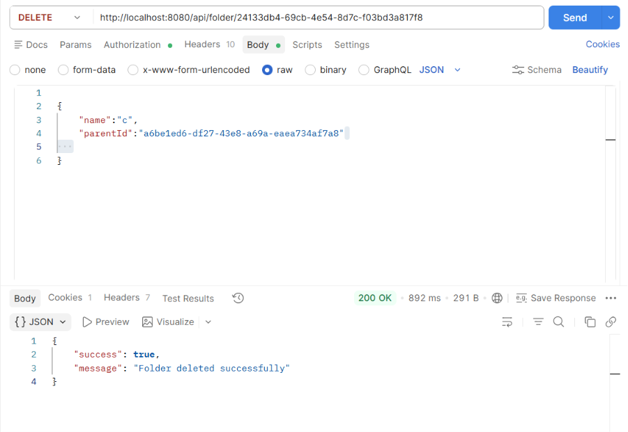
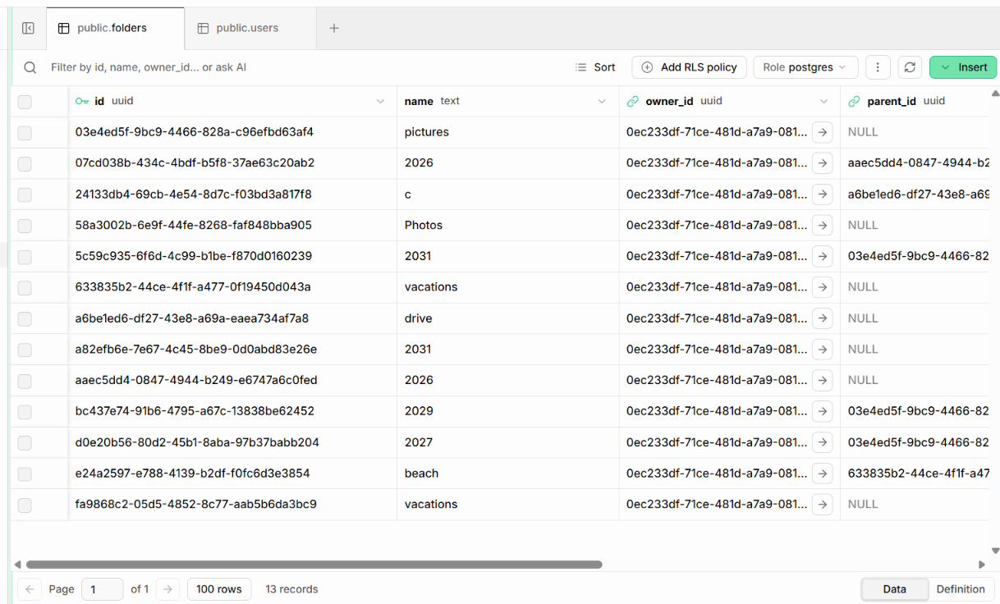

# Cloud Media Storage Service

A cloud-based media storage service built with React, Node.js, Express.js, PostgreSQL, and Supabase.

## Features

- User authentication
- File and folder management
- File versioning
- File sharing
- Public share links
- Starred files and folders
- Activity tracking
- Role-based access control

## Tech Stack

### Frontend
- React
- JavaScript
- CSS

### Backend
- Node.js
- Express.js
- PostgreSQL
- Supabase
- JWT
- bcrypt

### Storage
- Supabase Storage

## Backend Structure

```text
src/
├── config/
│   └── db.js
├── models/
│   └── user.model.js
├── services/
├── controllers/
├── middleware/
├── routes/
├── app.js
└── server.js
## Screenshots

### Login


### Dashboard


### Folders

